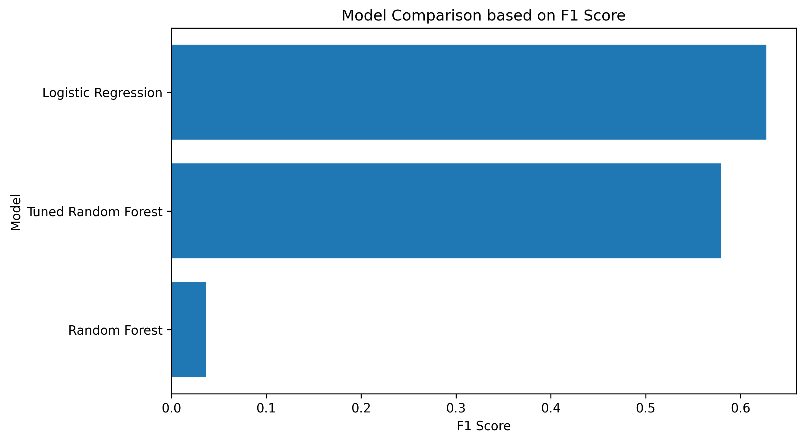
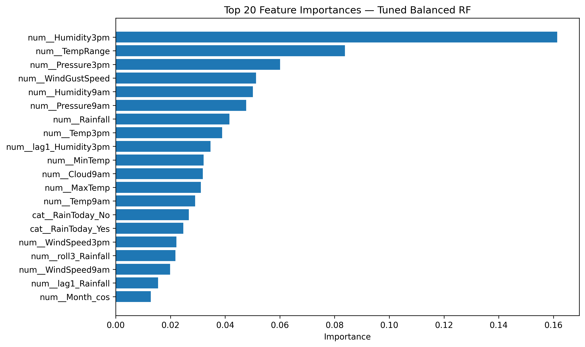

# 🌧️ RainTomorrow Prediction in Australia

## 📌 Project Overview

The goal of this project is to predict whether it will rain on the next day (`RainTomorrow`) using historical weather data from Australia.

This project follows a complete data science workflow, including:
- Data exploration (EDA)
- Data preprocessing
- Machine learning modeling
- Hyperparameter tuning
- Model evaluation and interpretation

---

## 📊 Dataset

The dataset contains approximately 10 years of daily weather observations from multiple locations in Australia.

Key features include:
- Temperature (MinTemp, MaxTemp)
- Humidity
- Pressure
- Wind speed and direction
- Rainfall

Target variable:
- **RainTomorrow** (Yes / No)

---

## ⚙️ Technologies Used

- Python
- pandas, numpy
- scikit-learn
- matplotlib
- Jupyter Notebook
- Git & GitHub

---

## 🔍 Project Workflow

### 1. Exploratory Data Analysis (EDA)
- Analysis of missing values
- Distribution of features
- Target variable analysis
- Correlation analysis

### 2. Data Preprocessing
- Removal of missing target values
- Dropping columns with too many missing values
- Feature engineering (e.g., temperature range)
- Encoding categorical variables
- Scaling numerical features

### 3. Model Training

Three models were trained and compared:

- Logistic Regression (baseline)
- Random Forest
- Tuned Random Forest (GridSearchCV)

---

## 🧠 Hyperparameter Tuning

To improve the Random Forest model, GridSearchCV with 3-fold cross-validation was used.

Optimized parameters:
- `n_estimators`
- `max_depth`
- `min_samples_split`
- `min_samples_leaf`

Evaluation metric:
- **F1-score**

---

## 📈 Results

The **Tuned Random Forest** achieved the best performance.

Key findings:
- Random Forest outperformed Logistic Regression
- Hyperparameter tuning improved performance
- F1-score was the most relevant metric due to class imbalance

---

## 📊 Model Evaluation

Evaluation metrics used:
- Accuracy
- Precision
- Recall
- F1-score
- ROC-AUC

Additional analysis:
- Confusion Matrix
- ROC Curve
- Feature Importance

---

## 🔑 Key Insights

- Humidity and pressure are strong predictors of rainfall
- Non-linear relationships play an important role
- Ensemble models (Random Forest) perform better than linear models

---

## 📁 Project Structure
weather-forecast-project/
 - data
 - weatherAUS.csv
 notebooks
 - weather_prediction.ipynb
 reports
 - model_comparison_f1.png
 - feature_importance_tuned_rf.png
 src
 README.md


---

## ▶️ How to Run the Project

1. Clone the repository:

```bash
git clone https://github.com/SirApollyon/weather-forecast-project.git
cd weather-forecast-project

python3 -m venv venv
source venv/bin/activate

pip install pandas numpy matplotlib scikit-learn jupyter seaborn

jupyter notebook

notebooks/weather_prediction.ipynb

Author: Roy Franke

## 📊 Model Comparison



## 🔍 Feature Importance


